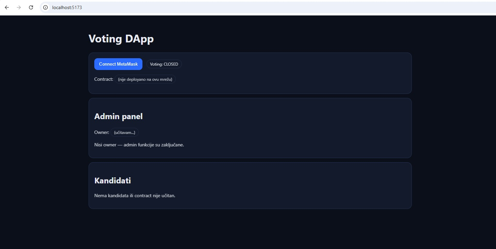
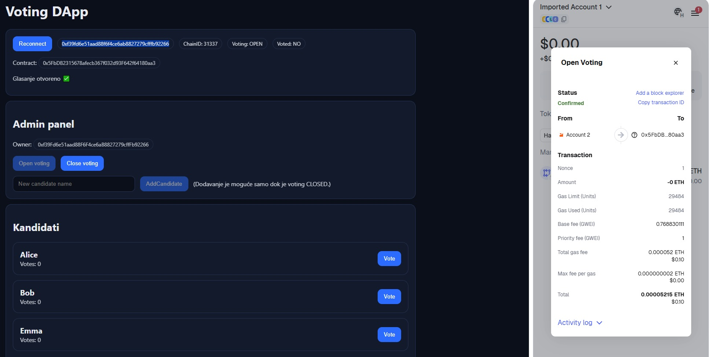
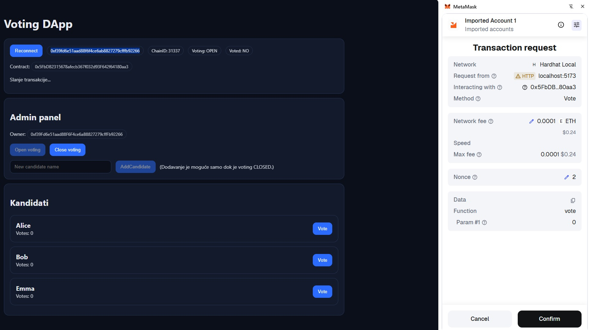
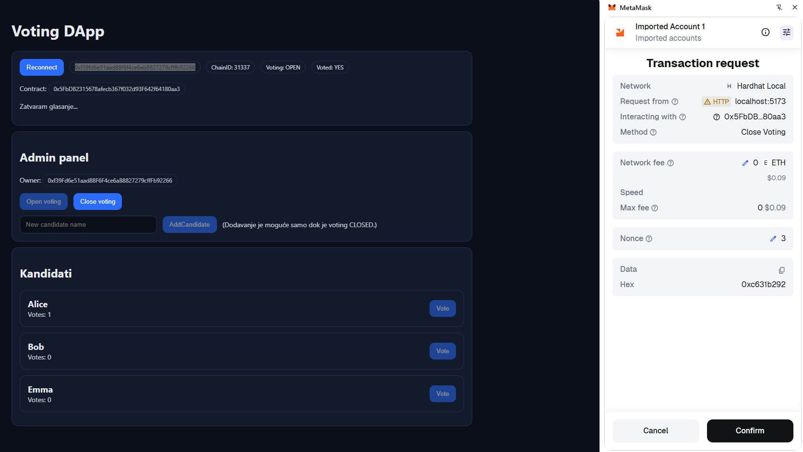
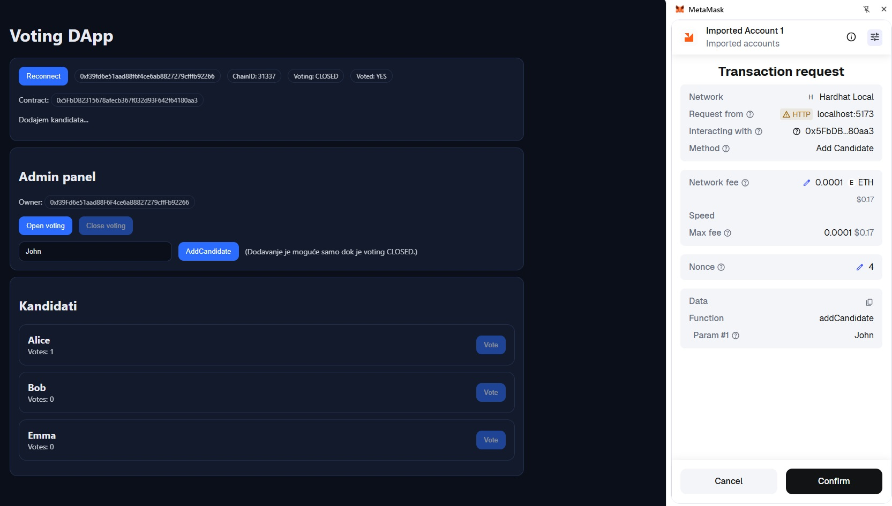
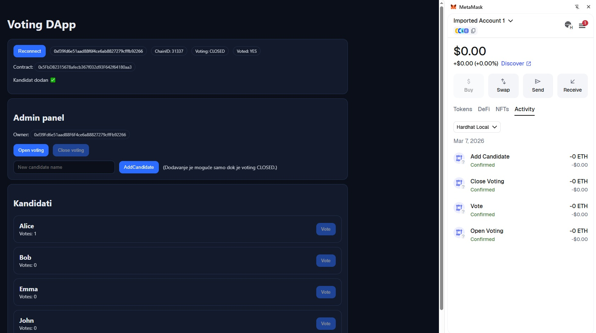

# Voting DApp
Web3 aplikacija za glasanje koju može koristiti široki spektar korisnika, primjerice studenti za izbor svojeg predsjednika zbora studenata, građani za izbor gradonačelnika i slično.

Omogućuje: 
- dodavanje kandidata (owner) 
- otvaranje i zatvaranje glasanja (owner) 
- glasanje (jedan glas po walletu) 
- prikaz rezultata 

## Značajke aplikacije (Features)
### Admin panel
Korisnik administrator (owner) kroz Admin panel unutar aplikacije može: 
- unijeti kandidate
- otvarati glasovanje
- zatvarati glasovanje

Admin panel omogućuje upravljanje cijelim procesom glasanja.

#### Dodavanje kandidata (Add candidate)
Administrator (owner) može dodati nove kandidate prije početka glasanja.

Svaki kandidat ima:

- Ime
- Broj glasova

Kandidati se pohranjuju u smart contractu na blockchainu.

#### Otvaranje glasanja (Open Voting)
Administrator (owner) može pokrenuti glasanje pomoću funkcije Open Voting.

Nakon otvaranja glasanja:

- Korisnici mogu glasati

- Glasovi se zapisuju na blockchain

#### Zatvaranje glasanja (Close Voting)
Administrator može zatvoriti glasanje pomoću funkcije Close Voting.

Nakon zatvaranja:

- Korisnici više ne mogu glasati

- Rezultati ostaju zapisani na blockchainu

### Glasanje za kandidata
Registrirani korisnici mogu glasati za jednog kandidata putem MetaMask walleta.

Svaki korisnik može glasati samo jednom (Vote).

### Prikaz rezultata glasanja
Aplikacija prikazuje:

- Listu kandidata

- Broj glasova za svakog kandidata

Rezultati se dohvaćaju direktno iz smart contracta.

### MetaMask integracija

- Aplikacija omogućuje korisnicima povezivanje s blockchainom putem MetaMask walleta.
- MetaMask se koristi za autentifikaciju korisnika i potpisivanje transakcija na Ethereum mreži.

### Korištene tehnologije

- Koristimo Solidity za razvoj smart contracta
- Hardhat razvojno okruženje (kompajliranje smart contracta, pokretanje lokalnog blockchaina, testiranje)
- Typescript - Hardhat skripte, testovi
- Ethers.js - biblioteka za komunikaciju s Ethereum blockchainom
- React - za frontend korisničko sučelje
- MetaMask - crypto wallet
- Mocha i Chai za testiranje smart contracta
- Ethereum blockchain platforma

## Screenshots (Pics)
**Slika 1 - App**

**Slika 2 - Open_Voting**

**Slika 3 - Vote**

**Slika 4 - Close_Voting**

**Slika 5 - AddCandidate**

**Slika 6 - Activity**

## Pokretanje aplikacije

Aplikacija je pokretana i testirana na lokalnom blockchain-u (hardhat)

1. Terminal VsCode (pokretanje lokalnog blockchaina (node-a))
npm run node 

2. Terminal (deploy contracta, kopiranje ABI-ja u frontend)
npm run compile
npx hardhat run scripts/deploy.ts --network localhost
npm run copy-abi

3. Terminal (pokretanje frontend aplikacije)
npm run frontend

- U MetaMask - dodati network 127.0.0.1:8545, Chain ID: 31337
- Import Account: uzeti jedan Private key koji dobijemo nakon pokretanja npm run node 
( npr. Account #0: 0xf39Fd6e51aad88F6F4ce6aB8827279cffFb92266 (10000 ETH)
Private Key: 0xac0974bec39a17e36ba4a6b4d238ff944bacb478cbed5efcae784d7bf4f2ff80)

- U web preglednik upisati: http://localhost:5173/
- Odabrati "Connect MetaMask"